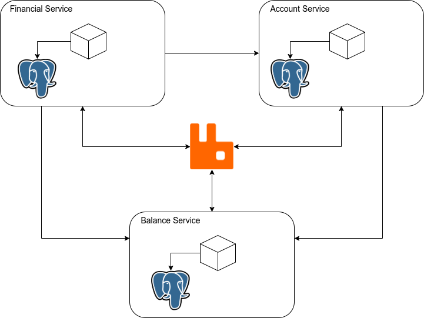

## Account Service

Account Service se trata do serviço responsável por realizar o controle das contas no geral.

Para executar o projeto, primeiro, deve ser iniciando o balance-service. Ele possui o setup inicial de algumas dependencias utilizadas nos outros projetos. Por exemplo: ele é o responsável por iniciar o container do RabbitMQ e as networks compartilhadas entre os serviços.

Assim, basta clonar o repositório [https://github.com/Felipecan/balance-service.git](https://github.com/Felipecan/balance-service.git) e executar o comando abaixo na pasta raiz:

```text
$ sudo docker-compose  up --build
```

O comando acima irá realizar o build da imagem e iniciar os containers do projeto balance-service.  

Em seguida, poderá ser feito o start de qualquer outro serviço. Para isso, basta clonar cada um dos projetos e realizar o mesmo comando acima na pasta raiz correspondente ao projeto.

## Funcionamento:

O funcionamento do serviço é simples. Ele é capaz de criar e atualizar uma conta em específico, além de realizar a consulta de uma determinada conta. 

Ao realizar a criação de uma conta, o serviço cria um registro inatívo para ela e em seguida insere uma mensagem na fila. Essa mensagem tem como objetivo consultar o balance-service para realizar a criação do saldo da conta e sendo assim, a tornar ativa.



## Endpoints:

1. POST /accounts

   Endpoint responsável por realizar a criação de uma determinada conta. É necessário o envio do seguinte payload:
   
   
   ```java
   {
      "name": "fulano",
      "identificationDocument": "11122233344"
   }
   ```
   
2. GET /accounts/{id}

   Endpoint responsável por consultar uma conta dado o identificador dela. É necessário passar o id na URL, referente a conta que deverá ser consultada. 
    
   
3. GET /accounts/details/{id}

   Endpoint responsável por consultar uma conta dado o identificador dela. É necessário passar o id na URL, referente a conta que deverá ser consultada. Diferente da consulta normal, essa trás o saldo da conta. Ao realizar a chamada, o serviço vai ao balance-service consultar o saldo que a conta deverá ter.
   
   
4. PUT /accounts/{id}

   Endpoint responsável por atualizar uma conta dado o identificador dela. É necessário passar o id na URL, referente a conta que deverá ser atualizada.
   
   ```java
   {
      "id": 1,
      "name": "fulano",
      "identificationDocument": "11122233344"
      "status": 0      
   }
   ```  
   
5. DELETE /accounts/{id}

   Endpoint responsável por deletar uma conta dado o identificador dela. É necessário passar o id na URL, referente a conta que deverá ser atualizada.


#### Links:

1. [financial-service](https://github.com/Felipecan/financial-service.git)

2. [account-service](https://github.com/Felipecan/account-service.git)